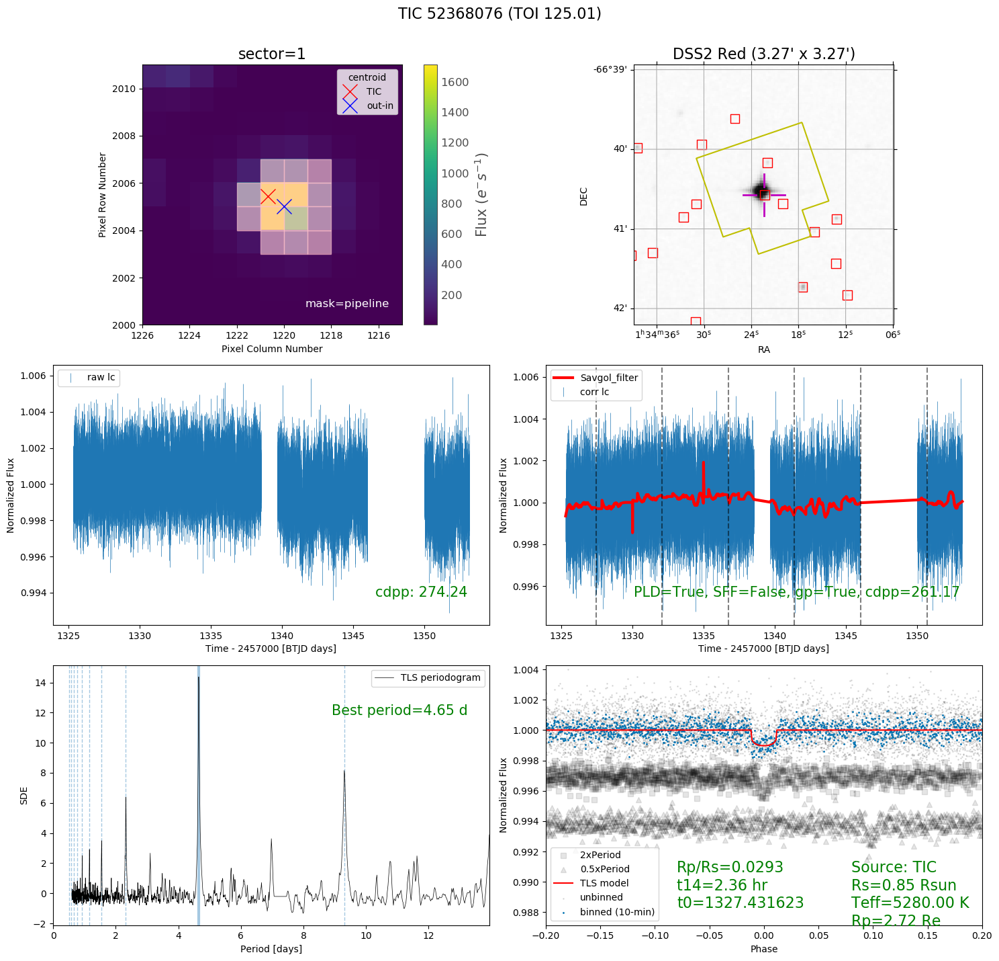

# TQL
TESS Quick Look plot generator

## Usage
```shell
$ make_tql --help

optional arguments:
  -h, --help            show this help message and exit
  --ra RA               R.A. [deg]
  --dec DEC             Dec. [deg]
  -n NAME, --name NAME  star name in database (e.g. WASP-80)
  --tic TIC             TIC ID e.g. 52368076
  --toi TOI             TOI ID e.g. 125.01
  --epic EPIC           EPIC ID e.g. 210490365
  --gaia GAIA           GAIA DR2 ID e.g. 3311804515502788352
  --lc {custom,sap,pdcsap}
                        lc type (default=custom):
                        [['custom: custom lightcurve from tpf']
                         ['sap: simple aperture photometry']
                         ['pdcsap: pre-data conditioning sap']]
  -m {pipeline,round,square,all,threshold,percentile}, --aper_mask {pipeline,round,square,all,threshold,percentile}
                        photometric aperture mask (default=pipeline):
                        [['pipeline: mask suggested by the official pipeline']
                         ['round: circular aperture mask']
                         ['square: square aperture mask']
                         ['all: all pixels within aperture']
                         ['threshold: all pixels brighter than 3-sigma above the median fluxpercentile: specific percentile of the flux distribution']]
  --sector SECTOR       e.g. --sector 1; default is first available sector
  --sectors [SECTORS [SECTORS ...]]
                        e.g. --sectors 1 2 3
  -a, --all_sectors     use data from all sectors (default=False)
  -r APER_RADIUS, --aper_radius APER_RADIUS
                        radius or side length (pix) for round or square aperture mask
  -perc PERCENTILE, --percentile PERCENTILE
                        percentile to make aperture mask
  -fov_only             plot FOV only
  -pld                  use Pixel-Level Decorrelation (PLD; default=False)
  -no_gp                do not use GP in PLD modeling (default=False)
  -sff                  use Self-Field Flattening (SFF; default=False)
  --aper_radii [APER_RADII [APER_RADII ...]]
                        aperture mask radii (pix) for pixel-level-analysis
  --percentiles [PERCENTILES [PERCENTILES ...]]
                        percentiles for pixel-level-analysis
  -s, --save            save figure (default=False)
  -o OUTDIR, --outdir OUTDIR
                        output directory (e.g. .txt, .png)
  -c, --clobber         clobber fits download (default=False)
  -v, --verbose         verbose (default=False)
  -no_quality_mask      Do not apply data quality mask from Data Release Notes
                                    [http://archive.stsci.edu/tess/tess_drn.html] (default=False)
  --cadence {short,long}
                        use short (2-min) or long (30-min) cadence data
  -col, --collate_only  collate all TLS results into table (add -s to save as .csv)
```




## Examples
1. Show quick look plots of TOI=125 (with details printed in the terminal using -v)
$ make_tql --toi=125.01 -v

The generated figure shows 6 panels (see gallery below):
* top, left: TESS target pixel file (a frame taken at the beginning of the observation) with superposed photometric aperture (pink)
* top, right: archival (DSS2 Red) image with superposed TESS aperture (yellow, same as the pink aperture in the tpf image) and nearby Gaia sources (red squares)
* middle, left: (a) raw TESS light curve with scattered light removed (`use_reg=True` by default) and produced using the given aperture if use_pld=use_sff=False [no systematics correction is used]; (b) corrected light curve otherwise; obvious outliers and bad pixels flagged in the fits file are removed
* middle, right: either (a) corrected light curve if either PLD or SFF correction is used or (b) flattened light curve otherwise. To remove the long time-scale variability of the light curve, a Savitzky-Golay filter (red curve) is used
* bottom, left: periodogram using transit least squares (TLS; Hippke et al. 2019). The best period is highlighted in dark blue and the vertical lines are harmonics of the period.
* bottom, right: scatter plot of phase-folded light curve (unbinned: black; binned at 10-min: blue) at the derived best period. A transit model (red) template is superposed.

Note that --ra, --dec & --tic & -n (--starname) can also be used. For example,
```
$ make_tql --tic=52368076 -v
$ make_tql --ra=23.5935 --dec=-66.6763 -v
$ make_tql -n=ngts-1 -v
$ make_tql -n=wasp-4 -v
```
2. Same as in (1) but include pixel-level decorrelation (PLD; Luger et al. 2016) to remove systematics (PLD implementation in lightkurve package uses GP by default):
```
$ make_tql --toi=125.01 -v -pld
$ make_tql --toi=125.01 -v -pld -no_gp (without gp)
```
Note that Self-Field Flattening (SFF; Vanderburg et al. 2014) is also available but may not work well in TESS case.

3. Same as in (2) but using data from sector 2 (instead of the default sector 1 above):
```
$ make_tql --toi=125.01 -v -pld --sector=2
```

4. Same as in (3) but only show archival FOV image by adding -fov_only:
$ make_tql --toi=125.01 -v -pld -fov_only
In this case, archival DSS2 Blue and Red images will be shown.

5. Same as in (3) but using specific photometric aperture:
```
$ make_tql --toi=125.01 -v -pld --aper_mask=pipeline (default)
$ make_tql --toi=125.01 -v -pld --aper_mask=round --aper_radius=1
$ make_tql --toi=125.01 -v -pld --aper_mask=square --aper_radius=2
$ make_tql --toi=125.01 -v -pld --aper_mask=percentile --percentile=90
$ make_tql --toi=125.01 -v -pld --aper_mask=threshold
$ make_tql --toi=125.01 -v -pld --aper_mask=all
```
Here -fov_only is useful to check if aperture includes or excludes nearby stars.

6. To analyze multi-sector data, just add -a or --all_sectors argument:
```
$ make_tql --toi=125.01 -v -pld -a
$ make_tql --toi=700.01 -v -pld --sectors 1 3 5 (download specific sectors not all)
```
Note that this does not show TESS tpf and archival FOV image

7. To compare two different apertures:
```
$ make_tql --toi=125.01 -v -pld --aper_mask=square --aper_radii 1 2
```

8. To analyze long cadence data (cutout from full-frame images)
```
$ make_tql --toi=125.01 -v --cadence=long -pld
```

9. Instead of custom lightcurves, try SAP|PDCSAP:
```
$ make_tql --toi=125.01 -v --lc=pdcsap
```

10. Just add -s argument to save the figure (*.png) and the flattened and phase-folded light curves (*.txt), and add -o argument to specify the output location. I recommend to save the output in your directory:  -o=/ut2/<your_username>/

## Advanced usage
If you would like to run tql on a list of TIC IDs (saved as new_tics.txt), then we have to make a batch script named run_tql_new_tics.batch. Its output files containing the plots (*.png) and corrected and phase-folded light curves (*.txt) will be saved in new_tics directory:
```
$ cat new_tics.txt | while read tic; do echo tql -tic=$tic -pld -s -o=../new_tics; done > run_tql_new_tics.batch
```
To test the Nth line of the batch script,
```
$ cat run_tql_new_tics.batch | sed -n Np | sh
```
To run all the lines in parallel using N cores (use -j<48 cores so that muscat-ut will not be very slow!),
```
$ cat run_tql_new_tics.batch | parallel -j N
```
After the batch script is done, we can collate or summarize the results of TLS in a .csv file:
```
$ make_tql -col -s -o=../new_tics
```

## Notes
* TOI are queried from [TESS Alerts](https://exofop.ipac.caltech.edu/tess/download_toi.php?sort=toi&output=csv) though some RA and DEC (e.g. TOI-144) are not precise enough to match a TPF using `lightkurve.search_targetpixelfile.`
* breakpoints based on [data release notes](http://archive.stsci.edu/tess/tess_drn.html) are manually encoded
* About `lightkurve`:
  - tpf was downloaded with `quality_bitmask='hardest'` so all flagged data is removed, although some obvious bad data can still show up ([here](https://github.com/jpdeleon/seidan/blob/master/tics_in_star_clusters/Hyades/TIC399697011.png) for example); try also `hard/default` to be less conservative; [see meaning of flags here](https://github.com/KeplerGO/lightkurve/blob/master/lightkurve/utils.py#L174)
  - `tpf.to_lightcurve().remove_nans().remove_outliers().normalize()` is likely very conservative but there can be remaining obvious outliers after checking preliminary results
  - pipeline was run in all known TOIs (see TOI folder) to test its effectiveness; only deep transits were recovered  
  - `tpf.to_corrector().correct()` is almost always necessary to detect signals in known TOIs
  - only `PLD` is available for TESS tpf with order=2 by default (n=1 uses only the pixel fluxes to construct the design matrix; higher order populates the design matrix with columns constructed from the products of pixel fluxes); see details [here](https://github.com/KeplerGO/lightkurve/blob/master/lightkurve/correctors/pldcorrector.py)
  - other generic periodogram can be used e.g. [BLS](https://docs.lightkurve.org/api/periodogram.html?highlight=periodogram)

## To do
* implement [`wotan`](https://ui.adsabs.harvard.edu/abs/2019arXiv190600966H/abstract)
* find additional planets by iterative masking of transit
* implement vetting procedure in sec 2.3 of [Heller+2019](https://arxiv.org/pdf/1905.09038.pdf)
  - SDE>9
  - odd_even_mismatch < 3σ
* use Gaia DR2 info (e.g. parallax, pm, rv) as additional constraints
* add dilution correction from `pixel-ninja`
* take note of [rolling bands](https://docs.lightkurve.org/tutorials/04-identify-rolling-band.html) in TESS, if there is any, which may be solved with background subtraction
* use web tess viewing tool (wtv.py) to double check if target is (already) observed
  - e.g. https://heasarc.gsfc.nasa.gov/cgi-bin/tess/webtess/wtv.py?Entry=04+47+42.0%2C+26+09+00
* use [TESS notebooks](https://github.com/spacetelescope/notebooks/tree/master/notebooks/MAST/TESS) as guide
* orient image properly to to show easy comparison with panel 1 and 2 (currently image is simply inverted!)

## Issues
* DEC axis in archival FOV image with superposed aperture mask shows wrong scale: only few arcsecond across, but Gaia source positions look correct
