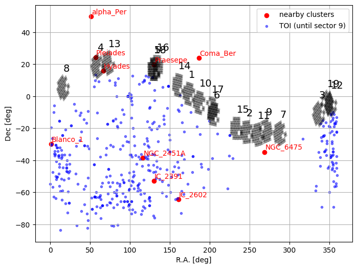

# TQL
TESS Quick Look light curve plot generator


## Data
* TESS tpf are downloaded from MAST via `lightkurve` package
* SDSS2 Red image with superposed TESS aperture (yellow) and Gaia sources (red squares) within roughly the same FOV as TESS postage stamp is shown for comparison (see QL figure below)


## Method
* given the coordinates of the cluster member from the table, TESS tpf file is searched using [`search_targetpixelfile`](https://docs.lightkurve.org/api/lightkurve.search.search_targetpixelfile.html#lightkurve.search.search_targetpixelfile)
* checks if the target happens to be flagged as [TOI](https://archive.stsci.edu/prepds/tess-data-alerts/#dataaccess); TOI number is indicated in the created figure, filename, and `kurasta.log`
* aperture photometry, systematics correction (optional use of PLD or SFF), period search (using TLS), and phase-folding are all done using [lightkurve](https://github.com/KeplerGO/lightkurve) and [transit least squares (TLS)](https://github.com/hippke/tls.git) packages 
* [TLS results](https://transitleastsquares.readthedocs.io/en/latest/Python%20interface.html#return-values) are also used for ranking signal detections


## Usage
```shell
$ ./make_tess_ql --help

usage: use "make_tess_ql --help" for more information

                generate QL summary figure for TESS targets

optional arguments:
  -h, --help            show this help message and exit
  -ra RA                R.A. [deg]
  -dec DEC              Dec. [deg]
  -n NAME, --name NAME  star name in database (e.g. WASP-80)
  -tic TIC              TIC
  -toi TOI              TOI e.g. 125.01
  -lc {sap,pdcsap}      lc pipeline (default=SAP):
                        [['sap: simple aperture photometry']
                         ['pdcsap: pre-data conditioning sap']]
  --aper_mask {pipeline,round,square,all,threshold}
                        photometric aperture mask (default=pipeline):
                        [['pipeline: mask suggested by the official pipeline']
                         ['round: circular aperture mask']
                         ['square: square aperture mask']
                         ['all: all pixels within aperture']
                         ['threshold: all pixels brighter than 3-sigma above the median flux']]
  --sector SECTOR       e.g. --sector 1; default is first available sector
  --sectors [SECTORS [SECTORS ...]]
                        e.g. --sectors 1 2 3
  -a, --all_sectors     use data from all sectors (default=False)
  -r APER_RADIUS, --aper_radius APER_RADIUS
                        radius or side length (pix) for round or square aperture mask
  -fov_only             plot FOV only
  -pld                  use Pixel-Level Decorrelation (PLD; default=False)
  -no_gp                do not use GP in PLD modeling (default=False)
  -sff                  use Self-Field Flattening (SFF; default=False)
  --aper_radii [APER_RADII [APER_RADII ...]]
                        aperture mask radii (pix) for pixel-level-analysis
  -s, --save            save figure (default=False)
  -o OUTDIR, --outdir OUTDIR
                        output directory (e.g. .txt, .png)
  -c, --clobber         clobber fits download (default=False)
  -v, --verbose         verbose (default=False)
  -no_quality_mask      Do not apply data quality mask from Data Release Notes
                                    [http://archive.stsci.edu/tess/tess_drn.html] (default=False)
  -dl_iers              download iers (default=False)
  -col, --collate_only  collate all TLS results into table (add -s to save as .csv)
```

* To summarize TLS results in one csv file, do `./make_tess_ql -col -o='../tics_in_star_clusters/Hyades' -s`
* To analyze data from all sectors, just add `-a` argument: 


## Notes
* TOI are queried from [TESS Alerts](https://exofop.ipac.caltech.edu/tess/download_toi.php?sort=toi&output=csv) though some RA and DEC (e.g. TOI-144) are not precise enough to match a TPF using `lightkurve.search_targetpixelfile.`
* breakpoints based on [data release notes](http://archive.stsci.edu/tess/tess_drn.html) are manually encoded
* About `lightkurve`:
  - tpf was downloaded with `quality_bitmask='hardest'` so all flagged data is removed, although some obvious bad data can still show up ([here](https://github.com/jpdeleon/kurasta/blob/master/tics_in_star_clusters/Hyades/TIC399697011.png) for example); try also `hard/default` to be less conservative; [see meaning of flags here](https://github.com/KeplerGO/lightkurve/blob/master/lightkurve/utils.py#L174)
  - `tpf.to_lightcurve().remove_nans().remove_outliers().normalize()` is likely very conservative but there can be remaining obvious outliers after checking preliminary results
  - pipeline was run in all known TOIs (see TOI folder) to test its effectiveness; only deep transits were recovered  
  - `tpf.to_corrector().correct()` is almost always necessary to detect signals in known TOIs
  - only `PLD` is available for TESS tpf with order=2 by default (n=1 uses only the pixel fluxes to construct the design matrix; higher order populates the design matrix with columns constructed from the products of pixel fluxes); see details [here](https://github.com/KeplerGO/lightkurve/blob/master/lightkurve/correctors/pldcorrector.py)
  - other generic periodogram can be used e.g. [BLS](https://docs.lightkurve.org/api/periodogram.html?highlight=periodogram)
* TOI with RV e.g. HARPS are cross-matched with existing database using [`archive_digger`](https://github.com/jpdeleon/archive_digger)


## To do
* implement vetting procedure in sec 2.3 of [Heller+2019](https://arxiv.org/pdf/1905.09038.pdf)
  - SDE>9
  - odd_even_mismatch < 3σ
* analyze TIC 410214986 (TOI 200.01): young DS Tuc system (40 Myr Tucana-Horologium young moving group)
* test masking of transit e.g. toi433
* take note of [rolling bands](https://docs.lightkurve.org/tutorials/04-identify-rolling-band.html) in TESS, if there is any, which may be solved with background subtraction
* add filters in arg
* find additional planets by iterative masking of transit
* use Gaia DR2 info (e.g. parallax, pm, rv) as cluster membership constraints
* use web tess viewing tool (wtv.py) to double check if target is (already) observed
  - e.g. https://heasarc.gsfc.nasa.gov/cgi-bin/tess/webtess/wtv.py?Entry=04+47+42.0%2C+26+09+00
* future search for planets in young systems:
  - HD 283869/ EPIC 248045685: (71.9250, 26.1500)
  - V830 Tau: (68.2918, 24.5620)
  - TAP 26: (64.7167, 17.3881)
  - CI TAU: (68.4667, 22.8417)
* add -cadence arg in a new script for long cadence FFI data with using [eleanor](http://adina.feinste.in/eleanor/index.html) package
* use [TESS notebooks](https://github.com/spacetelescope/notebooks/tree/master/notebooks/MAST/TESS) as guide
* check jgagneastro/finder_charts.py
* orient image properly to to show easy comparison with panel 1 and 2 (currently image is simply inverted!)
* for those with obvious systematics or stellar variability that is not easy to filter ([here](https://github.com/jpdeleon/kurasta/blob/master/tics_in_star_clusters/Hyades/TIC245833065.png) for example), try running `tpf.to_corrector(method='pld').correct(aperture_mask='pipeline', pld_order=2, use_gp=False/True)` i.e. with and without gp; both methods take t>20 minutes to run using my puny laptop
* `aperture_mask='pipeline` for aperture photometry should be customized if needed


## Issues
* DEC axis in archival FOV image with superposed aperture mask shows wrong scale: only few arcsecond across, but Gaia source positions look correct

## Notebooks (in development)
* K2 light curves of known cluster planets
  - visualizing corrected light curves
* TESS light curve examples
* nearest star clusters
* SFF and PLD
  - customizing each method for TESS
  - which is better for fast rotators and active stars?
* GP, filters and splines
  - GP built in SFF and PLD (uses george)
  - GP in everest, [sklearn](https://scikit-learn.org/stable/modules/gaussian_process.html)
  - Savgol filter vs BSpline and Median filter
* stellar rotational period with ACF and LSP
  - Autocorrelation Function and Lomb-Scargle Periodogram examples
* TLS
  - customizing TLS for cluster planets
* properties known cluster planets and their hosts
  - Ms vs. Rp
  - Rp vs. Porb?
* applying the method to known cluster planets
  - can the transits be recovered?
* cluster properties based on Gaia DR2 data
  - galactic position
  - proper motion and radial velocity
  - HRD per cluster from Gaia DR2 (see paper)
  - distributions of host star properties (Teff, Rstar, logg, etc.)
* From published literature data
  - stellar rotation period, Prot, distribution per cluster?
  - Prot vs. Spectral Type (e.g., see Mann et al.)

## Cluster location, TOIs, and k2 fields 



## Animation of cluster members
* Space motion using Gaia DR2 of some clusters are simulated here for t=[-500,500]yr [here](./notebooks). For example: 


## Questions
* What do we know about known cluster planets and their host stars?
* Can we constrain Prot using Teff,Rs,logg, etc. from Gaia DR2?
* Does adding prior on stellar rotation period per cluster help model stellar variability better?
* Does using gp built in everest pipeline correct raw/SAP TESSS light curves as input?
* Does masking transits in TOI improve correction (does not cause overfitting)?
