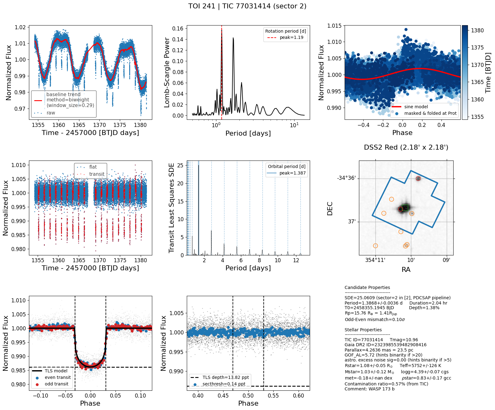

Usage
=====

.. _installation:

Installation
------------

To use TQL, first install it using pip:

.. code-block:: console

   (.venv) $ pip install tql

Scripts
-------

``tql`` handles TESS short cadence data (from `SPOC <https://archive.stsci.edu/hlsp/tess-spoc>`_ pipeline) and long cadence data (from `QLP <http://archive.stsci.edu/hlsp/qlp>`_, `CDIPS <http://archive.stsci.edu/hlsp/cdips>`_, `PATHOS <http://archive.stsci.edu/hlsp/qlp>`_, `DIAmante <http://archive.stsci.edu/hlsp/diamante>`_, and custom pipelines) light curves.
``kql`` handles K2 short cadence (SPOC pipeline) and long cadence (`EVEREST <https://archive.stsci.edu/hlsp/everest>`_, `K2SFF <https://archive.stsci.edu/hlsp/>`_). 
Note that the `chronos <https://github.com/jpdeleon/chronos>`_ package is a dependency.

.. code-block:: console

  optional arguments:
    -h, --help            show this help message and exit
    -gaia GAIA            Gaia DR2 ID
    -toi TOI              TOI ID
    -tic TIC              TIC ID
    -coords COORDS COORDS
                          e.g. '08:09:10 -05:04:23' or '22.5 -12.56'
    -name NAME            target name
    -sec SECTOR, --sector SECTOR
                          TESS sector
    -c {long,short}, --cadence {long,short}
                          30-min long or 2-min short (default)
    -sr SEARCH_RADIUS, --search_radius SEARCH_RADIUS
                          search radius in arcsec (default=3)
    -lc {pdcsap,sap,custom,cdips,pathos,qlp,diamante}, --lctype {pdcsap,sap,custom,cdips,pathos,qlp,diamante}
                          type of lightcurve
    -a {pipeline,round,square,percentile,threshold}, --aper_mask {pipeline,round,square,percentile,threshold}
                          aperture mask type
    -t THRESHOLD, --threshold THRESHOLD
                          mask threshold in sigma
    -r APER_RADIUS, --aper_radius APER_RADIUS
                          mask radius in pix
    -perc PERCENTILE, --percentile PERCENTILE
                          mask percentile
    -qb {none,default,hard,hardest}, --quality_bitmask {none,default,hard,hardest}
    -size CUTOUT_SIZE CUTOUT_SIZE, --cutout_size CUTOUT_SIZE CUTOUT_SIZE
                          FFI cutout size for long cadence (default=[12,12] pix)
    -method FLATTEN_METHOD, --flatten_method FLATTEN_METHOD
                          wotan flatten method (default=biweight)
    -w WINDOW_LENGTH, --window_length WINDOW_LENGTH
                          flatten method window length (default=0.5 days)
    -e EDGE_CUTOFF, --edge_cutoff EDGE_CUTOFF
                          cut each edges (default=0.1 days)
    --sigma_clip_raw SIGMA_CLIP_RAW SIGMA_CLIP_RAW
                          (sigma_lo,sigma_hi) for outlier rejection after
                          flattening lc
    --sigma_clip_flat SIGMA_CLIP_FLAT SIGMA_CLIP_FLAT
                          (sigma_lo,sigma_hi) for outlier rejection after
                          flattening lc
    -qm, --quality_mask   remove chunks of bad cadences identified in data
                          release notes
    -plims PERIOD_LIMITS PERIOD_LIMITS, --period_limits PERIOD_LIMITS PERIOD_LIMITS
                          period limits in TLS periodogram search; default=(0.5,
                          baseline/2) days
    -b BIN_HR, --bin_hr BIN_HR
                          bin size in folded lc (default=4 hr if -c=long else
                          0.5 hr)
    -n NEARBY_GAIA_RADIUS, --nearby_gaia_radius NEARBY_GAIA_RADIUS
                          nearby gaia sources to consider (default=120 arcsec)
    -u, --use_priors      use star priors for detrending and periodogram
    -g, --gls             run GLS pipeline
    -f, --find_cluster    find if target is in cluster (default=False)
    -s, --save            save figure and tls
    -o OUTDIR, --outdir OUTDIR
                          output directory
    -v, --verbose         show details
    --redo                overwrite
    -img, --use_archival_image
                          plot gaia sources on archival image instead of tpf
    -var, --check_if_variable
                          check if target is in variable star catalog
    -em EPHEM_MASK EPHEM_MASK EPHEM_MASK, --ephem_mask EPHEM_MASK EPHEM_MASK EPHEM_MASK
                          mask ephemeris given period and t0

Examples
--------

1. Show quick look plot of TOI 241.01 with archival image

.. code-block:: console

  tql -toi 241 -img

The generated figure shows 9 panels (see plot below):

* top row
  
  * left: background-subtracted, PLD-corrected lightcurve and trend
  * middle: lomb-scargle periodogram
  * right: phase-folded at peak stellar rotation period (if any)
  
* middle row
  
  * left: flattened lightcurve and transit (determined from TLS on the right)
  * middle: TLS periodogram
  * right: phase-folded lightcurve at orbital period
  
* bottom row
  
  * left: phase-folded lightcurve of odd and even transits with transit depth reference
  * middle: tpf with overlaid TESS aperture and annotated gaia sources
  * right: summary info

.. code-block:: console

  tql -tic 52368076 -v -s (uses pdcsap by default)
  tql -toi 125.01 -v  -s -lc sap
  tql -toi 125.01 -v -s -sec 2 (specify sector)
  tql -toi 125 -v  -s -c long (long cadence, custom by default)
  tql -toi 125.01 -v -a pipeline (default aperture)
  tql -toi 125.01 -v -a round -r 1 (round aperture 1 pix in radius)
  tql -toi 125.01 -v -a square -r 2 (square aperture 2 pix in radius)
  tql -toi 125.01 -v -a percentile -perc 90
  tql -toi 125.01 -v -a threshold -t 5
  tql -toi 125.01 -v -a threshold -g (gls periodogram)
  tql -toi 125 -v  -s -c long -lc qlp (Quick Look Pipeline)
  tql -toi 125 -v  -s -c long -lc cdips (CDIPS Pipeline)
  tql -toi 125 -v  -s -c long -lc pathos (PATHOS Pipeline)shellshell

For K2 lightcurves,

.. code-block:: console

  kql -name 'k2-95' -v -img -s -lc k2sff -c long              
  kql -name 'k2-95' -v -img -s -lc everest -c long              

Advanced usage
--------------

If you would like to run tql on a list of TIC IDs (saved as new_tics.txt), then we have to make a batch script named run_tql_new_tics.batch. Its output files containing the plots (*.png) and tls_results (*.h5) will be saved in new_tics directory:

.. code-block:: console

  cat new_tics.txt | while read tic; do echo tql -tic $tic -pld -s -o ../new_tics; done > run_tql_new_tics.batch

To test the Nth line of the batch script,

.. code-block:: console

  cat run_tql_new_tics.batch | sed -n Np | sh

To run all the lines in parallel using N cores (use -j<48 cores so that muscat-ut will not be very slow!),

.. code-block:: console

  cat run_tql_new_tics.batch | parallel -j N

After the batch script is done, we can rank TLS output in terms of SDE using rank_tls script:

.. code-block:: console

  rank_tls indir

Run in Google colab
-------------------
Open `example notebook in google colab <https://colab.research.google.com/github/jpdeleon/tql/blob/master/notebooks/examples.ipynb" target="_parent">`_

